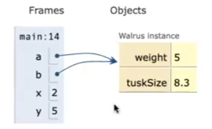

# Java常用的Class
## List
在使用List之前，先导入List所在的库
```java
import java.util.List;
```
在hava中有两种类型实现list
```java
//List 的ArrayList 实现
import java.util.ArrayList;
List<String> list1 = new ArrayList<>();

// List 的LinkedList 实现
import java.util.LinkedList;
List<String> list2 = new LinkedList<>();
```
ArrayList的常用接口
```java
import java.util.List;
import java.util.ArrayList;

class Main {

    public static void main(String[] args) {
        //使用ArrayList类创建列表
        List<Integer> numbers = new ArrayList<>();

        //将元素添加到列表
        numbers.add(1);
        numbers.add(2);
        numbers.add(3);
        System.out.println("List: " + numbers);

        //从列表中访问元素
        int number = numbers.get(2);
        System.out.println("访问元素: " + number);

        //从列表中删除元素
        int removedNumber = numbers.remove(1);
        System.out.println("删除元素: " + removedNumber);
    }
}
```
```
List: [1, 2, 3]
访问元素: 3
删除元素: 2
```
LinkedList
```java
import java.util.List;
import java.util.LinkedList;

class Main {

    public static void main(String[] args) {
        //使用LinkedList类创建列表
        List<Integer> numbers = new LinkedList<>();

        //将元素添加到列表
        numbers.add(1);
        numbers.add(2);
        numbers.add(3);
        System.out.println("List: " + numbers);

        //从列表中访问元素
        int number = numbers.get(2);
        System.out.println("访问元素: " + number);

        //使用indexOf()方法
        int index = numbers.indexOf(2);
        System.out.println("位置3的元素是 " + index);

        //从列表中删除元素
        int removedNumber = numbers.remove(1);
        System.out.println("删除元素: " + removedNumber);
    }
}
```
```
List: [1, 2, 3]
访问元素: 3
位置3的元素是 1
删除元素: 2
```
## Set

## Map

## String

# class互相之间的赋值
java中class的相互赋值只是变了指针，不会new 一个新的class实例,但基本类型会开一个新的
```java
public class PollQuestions {
    public static void main(String[] args) {
        Walrus a = new Walrus(1000, 8.3);
        Walrus b;
        b = a;
        b.weight = 5;
        System.out.println(a);
        System.out.println(b);

        int x = 5;
        int y;
        y = x;
        x = 2;
        System.out.println("x is: " + x);
        System.out.println("y is: " + y);
    }
}
```

关键在于，当我们声明一个Walrus的时候并没有实际上创造一个实例，只是声明了一个可以用来装walrus的address的变量，只有到new里面才创造了这个实例
只有基本类型会开一个新的储存空间
