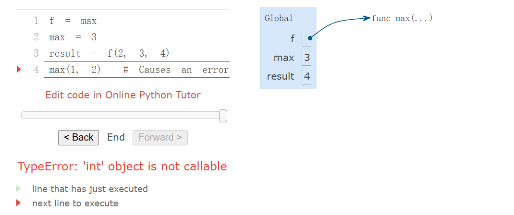

## intro
基础的$python$语法，用$def$创建函数,基本的循环分支结构略去不提了,高中学过了
对于纯过程的函数返回值为None
## high order function&environment
### environment&binding

**函数签名(function signature)**
函数在允许接收的参数数量上有所不同。为了跟踪这些要求，我们用一种方式表示每个函数，以显示函数名称及其形式参数。例如，用户定义的函数 square 只接受一个参数 x；提供多于或少于一个参数都会导致错误。函数的形式参数的描述被称为函数的签名。
**应用用户定义的函数**
应用用户定义的函数会引入一个额外的局部帧，该帧仅对该函数可见。要将用户定义的函数应用于某些参数，需要执行以下步骤：
在一个新的局部帧中，将参数绑定到函数的形式参数的名称上。
在以这个帧为起点的环境中执行函数体。
环境中帧的顺序会影响在表达式中查找名称时返回的值。我们之前提到，一个名称的值是当前环境中与该名称相关联的值。现在我们可以更精确地描述：
**名称求值**
一个名称的值是当前环境中最早出现该名称的帧中绑定到该名称的值。
我们关于环境、名称和函数的概念框架构成了一个求值模型。尽管某些机械细节仍未具体说明（例如，绑定是如何实现的），但我们的模型精确且正确地描述了解释器是如何求值调用表达式的。

以上是一些比较抽象的东西，主要目的是辅助理解interpreter的本质
**词法作用域**
局部定义的函数也可以访问其定义范围内绑定的名称。在以下示例中，sqrt_update 引用了名称 a，而 a 是其外层函数 sqrt 的一个形式参数。这种在嵌套定义中共享名称的规则被称为词法作用域。关键在于，内部函数可以访问其定义时所在环境中的名称（而不是调用时的环境）。
为了支持词法作用域，我们需要对环境模型进行两项扩展：
每个用户定义的函数都有一个父环境：即该函数被定义时的环境。
当用户定义的函数被调用时，它的局部帧会扩展其父环境。
示例说明
假设我们有一个函数 sqrt，它定义了一个内部函数 sqrt_update，如下所示：
Python复制
def sqrt(a):
    def sqrt_update(x):
        return (x + a / x) / 2
    def sqrt_close_enough(x):
        return abs(x * x - a) < 0.001
    # 其他逻辑...
在这个例子中：
sqrt_update 和 sqrt_close_enough 是在 sqrt 的作用域内定义的内部函数。
sqrt_update 可以访问 a，因为 a 是 sqrt 的形式参数，而 sqrt_update 的定义环境是 sqrt 的局部环境。
当 sqrt 被调用时，sqrt_update 的局部帧会扩展 sqrt 的局部帧，因此 sqrt_update 可以访问 a。
这种机制确保了内部函数可以访问其定义时所在环境中的变量，而不仅仅是调用时的环境。这种行为在嵌套函数中非常有用，因为它允许内部函数捕获并使用外部函数的局部变量。
关键点总结
**词法作用域**：内部函数可以访问其定义时所在环境中的变量（如 a），而不是调用时的环境。
**环境链**：每个函数调用创建一个局部帧，并将其父环境设置为定义该函数时的环境。查找变量时，Python 会沿着环境链逐层查找。
局部函数的优势：
**独立性**：局部函数的名称只在定义它的环境中有效，不会与其他环境冲突。
**封装性**：局部函数可以访问外部函数的局部变量，实现强大的封装和模块化。
Python 装饰器（Decorators）的使用和原理
Python 提供了一种特殊的语法来在执行 def 语句时应用高阶函数，这种语法被称为装饰器（Decorator）。最常见的例子是用于跟踪函数调用的 trace 装饰器。
示例代码
Python复制
>>> def trace(fn):
        def wrapped(x):
            print('-> ', fn, '(', x, ')')
            return fn(x)
        return wrapped

>>> @trace
    def triple(x):
        return 3 * x

>>> triple(12)
->  <function triple at 0x102a39848> ( 12 )
36
解释
在这个例子中：
定义装饰器 trace：
trace 是一个高阶函数，它接受一个函数 fn 作为参数，并返回一个新的函数 wrapped。
wrapped 函数在调用 fn 之前，会打印一条消息，显示被调用的函数和它的参数。
使用装饰器 @trace：
在 triple 函数的定义前加上 @trace，这会影响 def 语句的执行规则。
按照常规，triple 函数会被创建，但它的名字不会直接绑定到这个函数本身。
相反，triple 名字会被绑定到 trace(triple) 返回的函数值上。
等价代码：
使用装饰器的代码等价于以下代码：
Python复制
>>> def triple(x):
        return 3 * x
>>> triple = trace(triple)
这意味着 triple 现在指向的是 trace 返回的 wrapped 函数，而不是原始的 triple 函数。
执行过程：
当调用 triple(12) 时，实际上是调用了 wrapped(12)。
wrapped 函数打印了调用信息，并调用了原始的 triple 函数，返回结果 36。
装饰器的高级用法
装饰器符号 @ 后面也可以跟一个调用表达式。执行顺序如下：
先计算 @ 后面的表达式（例如 trace）。
执行 def 语句，定义函数。
将装饰器表达式的结果应用到新定义的函数上，并将结果绑定到 def 语句中的名字。
例如：
Python复制
>>> @trace()
    def triple(x):
        return 3 * x
这里 trace() 会被先计算，返回一个新的函数。
然后 triple 被定义。
最后，triple 被绑定到 trace() 返回的函数上。
总结
装饰器是一种强大的工具，用于在不修改函数本身的情况下，增强或修改函数的行为。它们常用于日志记录、性能测试、事务处理等场景。装饰器的使用可以让代码更加简洁和模块化。
## high order function
注意我们可以使用
```python
def apply_twice(f,x):
  return f(f(x))
def square(x):
  return x*x
apply_twice(square,3)
```
说明可以传入一个函数作为参数来进行调用，在使用时环境会将f和square做一个绑定
同时，我们可以使用
```python 
def make_adder(n):
  def adder(k):
    return k+n
  return adder
add_three=make_adder(3)
add_three(4)
```
说明可以返回一个函数并且作为一个参数保存，`make_adder(3)`保存到了`add_three`中，调用`add_three(4)`此时会去`make_adder`这个frame中，找到`adder`这个函数，此时n已经被绑定为3了

### lambda表达式
```python
x=10
square=x*x
square=lambda x:x*x//这是一个函数的简单定义，参数为x，返回值为x*x
```
注意这里不需要`return`,只能表达一个基础的表达式，不能使用语句

lambda和def的区别在于它们的本质名字(intrinsic name)是不同的,用lambda定义的，square的本质名字为lambda
可以这么写来实现函数的递归，这是lab中的一个题
```python
def make_repeater(f, n):
    """Returns the function that computes the nth application of f.

    >>> add_three = make_repeater(increment, 3)
    >>> add_three(5)
    8
    >>> make_repeater(triple, 5)(1) # 3 * (3 * (3 * (3 * (3 * 1))))
    243
    >>> make_repeater(square, 2)(5) # square(square(5))
    625
    >>> make_repeater(square, 3)(5) # square(square(square(5)))
    390625
    """
    "*** YOUR CODE HERE ***"
    if n==1:
        return f
    else:
        return lambda x: f(make_repeater(f,n-1)(x))
```
### function currying
Currying:Transforming a multi-argument function into a single-argument,high-order function.
```python
def:curry2(f):
  def g(x):
    def h(y):
      return f(x,y)
    return h
  return g
from operator import add
add(2,3)
m=curry2(add)
add_three=m(3)
```
```python
curry2=lambda f:lambda x:lambda y:f(x,y)
from operator import add
m=curry2(add)
m(2)(3)
```
都是curry的一个写法，都可以实现功能
